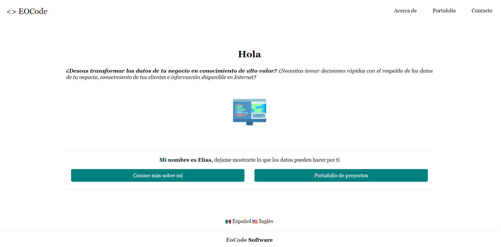
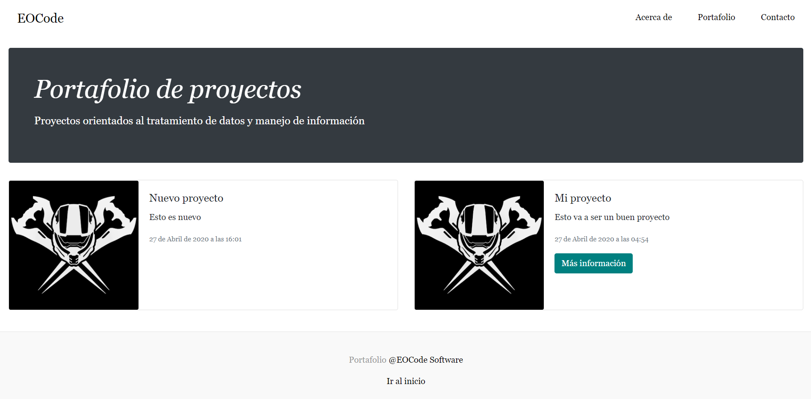

# Personal Page with Django

Practice Django with a page with personal info and contact

# Features
* Home Page
* About me
* Portfolio
* Contact me
* Admin Panel

# Preview
<div align="center">
  
  <small><p>Personal Page (Home)</p></small>
</div>

<div align="center">
  
  <small><p>Portafolio de proyectos</p></small>
</div>

# How to run

```shell
pip install -r requirements.txt
python manage.py migrate
python manage.py runserver
```

# How to contribute

Make a pullrequest to this repo contact me in social networks as eocode