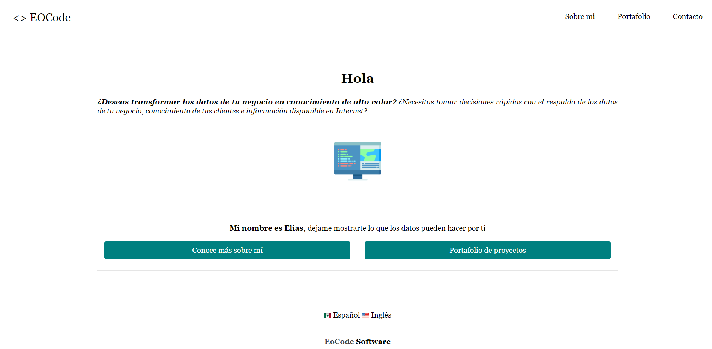
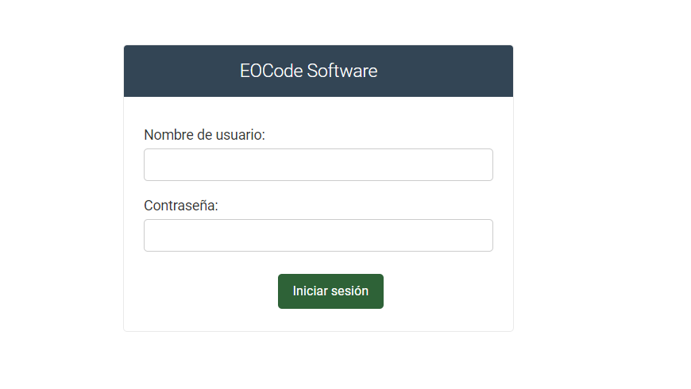
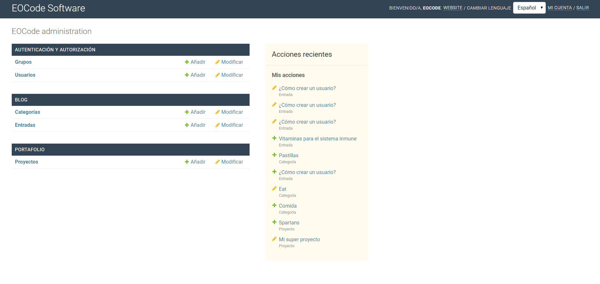

# Personal Page with Django

Practice Django with a page with personal info and contact

# Features
* ✔ Landing Page
* ✔ About me
* ✔ Portfolio
* ✔ Blog
* ✔ Contact me
* ✔ Admin Panel Customized
* ✔ Roles and Permissions
* ✔ Support Internationalization I18N (Es/En)
* ❎ SSR with React
* ❎ RESTFULL API
* ❎ GraphQL API
* ❎ Google Cloud Deploy

# Preview

<div align="center">
  
  <small><p>Personal Page with Internationalization (Home)</p></small>
</div>

<div align="center">
  
  <small><p>Personalized Admin</p></small>
</div>

<div align="center">
  
  <small><p>Personalized Admin Login</p></small>
</div>

<div align="center">
  
  <small><p>Portafolio de proyectos</p></small>
</div>

# How to run

```shell
pip install -r requirements.txt
python manage.py migrate
python manage.py runserver
```

# How to contribute

Make a pullrequest to this repo contact me in social networks as eocode